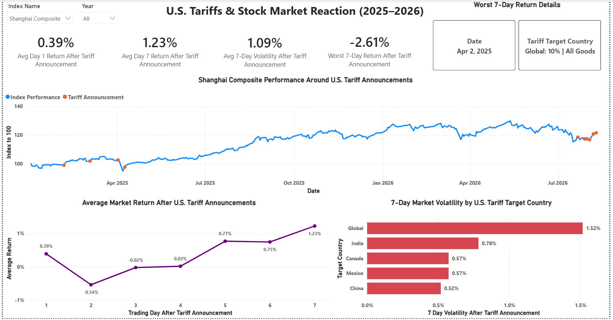
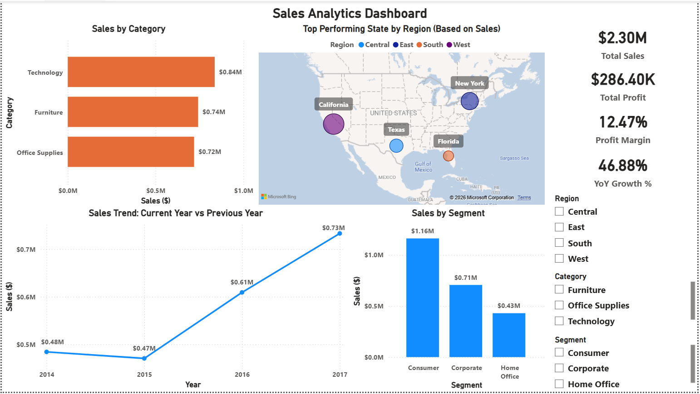
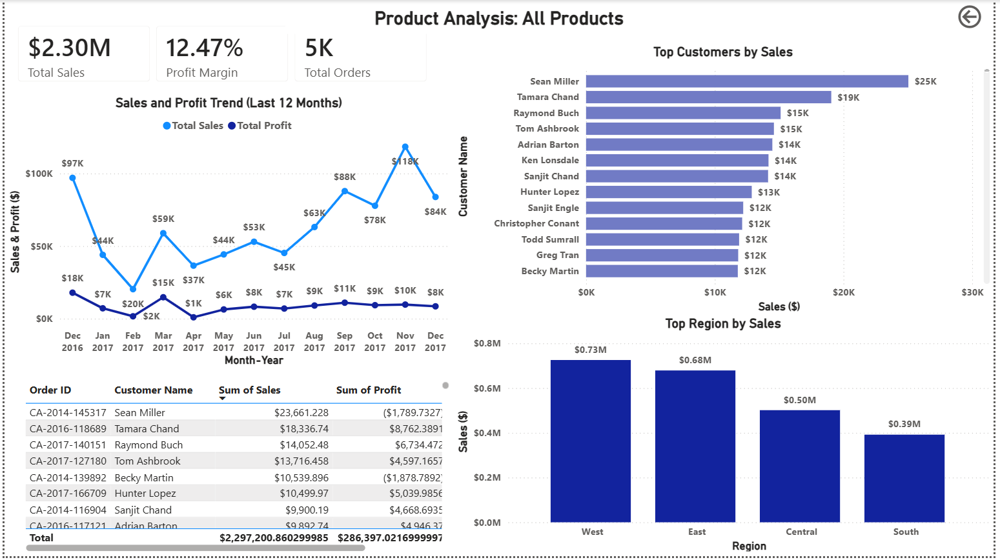

# Power BI Portfolio

A collection of Power BI dashboards demonstrating data analysis, DAX, Power Query, data modelling, and interactive data visualization.

---

## U.S. Tariff & Stock Market Reaction Analysis

Analyzed how the S&P 500 and Shanghai Composite moved following U.S. tariff announcements from January 2025 to August 2026.

**Power BI | DAX | Power Query | Data Modelling | Data Visualization**

#### S&P 500

#### Shanghai Composite

---

---

## Superstore Sales Dashboard

Built an interactive Power BI dashboard analyzing sales performance across products, regions, and customer segments.

**Power BI | DAX | Power Query | Data Modelling | RLS | Drill-through**

### Executive Dashboard

### Detailed Analysis

---

## NYC Taxi Performance Analytics

Built a Power BI dashboard to analyze NYC taxi performance, including monthly revenue, trip volume, and fare trends. Data was processed using Azure Data Lake and Databricks with a Medallion Architecture.

**Power BI | Azure Databricks | PySpark | Azure Data Lake | Data Engineering**

### Performance Dashboard

